# 个人任务项目管理系统 - 功能介绍

一款基于艾森豪威尔矩阵的智能任务管理系统，帮助您高效管理任务和项目。

---

## 🎯 核心功能

### 1. 任务管理

#### 1.1 艾森豪威尔四象限视图

基于紧急性和重要性两个维度，将任务自动分类到四个象限：

- **紧急且重要**：需要立即处理的关键任务
- **重要但不紧急**：需要规划和安排的重要任务
- **紧急但不重要**：可以委派或快速处理的任务
- **既不紧急也不重要**：可以考虑删除或延后的任务

📸 **截图展示**：

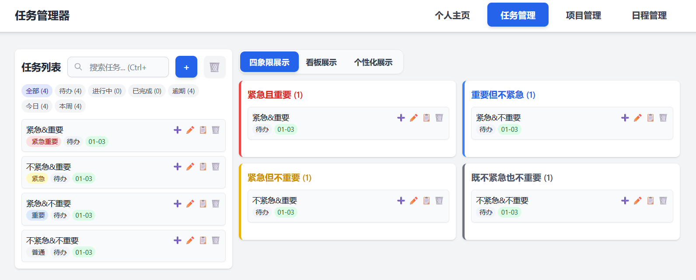
---

#### 1.2 看板视图

按任务状态（待办、处理中、已完成）组织任务，支持拖拽改变任务状态。

📸 **截图展示**：

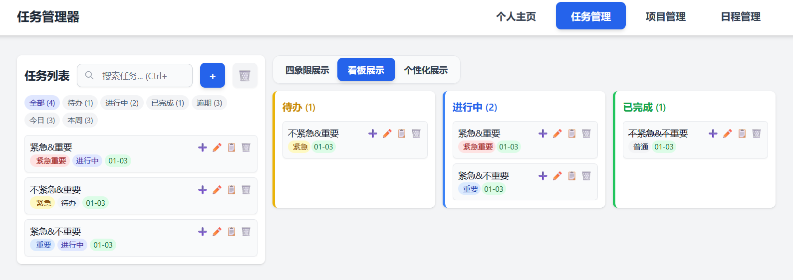
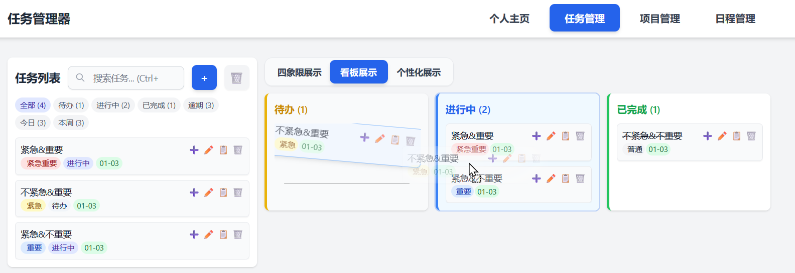

---

#### 1.3 个性化标签视图

自定义标签系统，按照您的分类方式组织任务：

- 创建自定义标签（支持颜色和描述）
- 拖拽任务到标签进行分类
- 一个任务可以有多个标签

📸 **截图说明**：
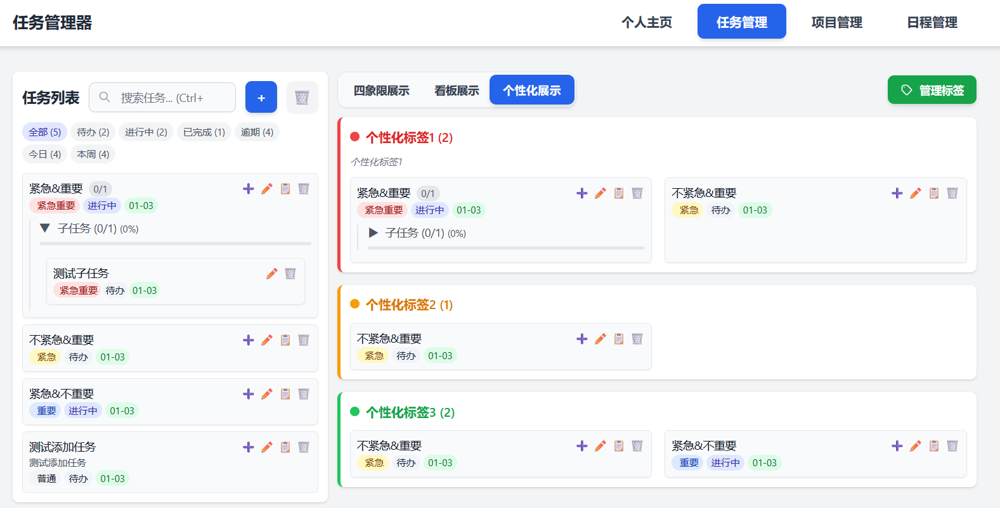


---

#### 1.4 任务操作功能

| 功能 | 说明 |
|------|------|
| ➕ 创建任务 | 点击"+"按钮快速创建子任务 |
| ✏️ 编辑任务 | 修改任务标题、描述、截止日期等 |
| 📋 复制任务 | 一键复制任务及其子任务 |
| 🗑️ 删除任务 | 单个删除或批量删除 |
| 🔍 搜索任务 | 支持按标题、描述、状态等搜索 |

📸 **截图说明**：


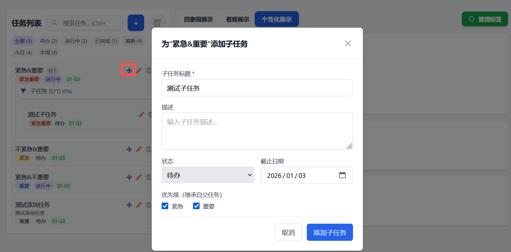
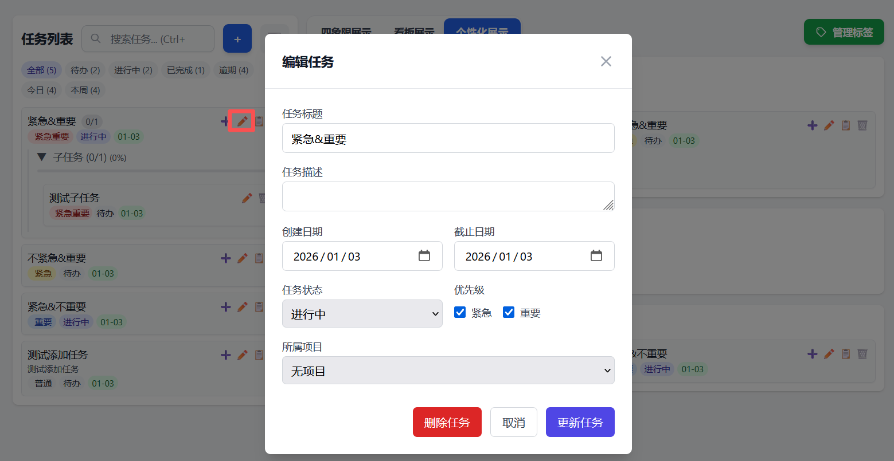
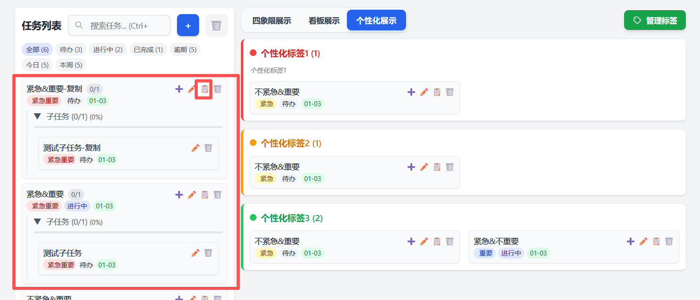
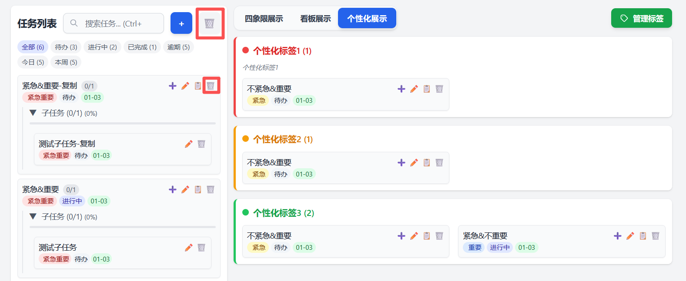


---

#### 1.5 批量删除功能

高效管理大量任务：

1. 点击删除按钮进入批量删除模式
2. 勾选需要删除的任务（支持全选）
3. 确认删除选中的任务

📸 **截图说明**：


---

#### 1.6 子任务管理

支持为主任务创建子任务，更好地分解复杂任务：

- 点击任务卡片上的"➕"按钮添加子任务
- 子任务独立管理状态
- 主任务显示子任务完成进度

📸 **截图说明**：


---

### 2. 项目管理

#### 2.1 项目概览

创建和管理多个项目，每个项目可以包含多个任务：

- 项目状态：规划中、处理中、已完成、暂停
- 项目进度可视化
- 项目筛选和搜索

📸 **截图说明**：

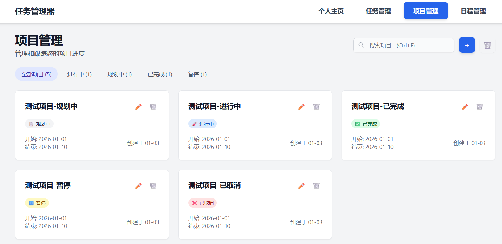


---

#### 2.2 项目详情

进入项目查看详细信息和关联任务：

- 项目基本信息
- 项目下的任务列表
- 项目笔记/记录

📸 **截图说明**：

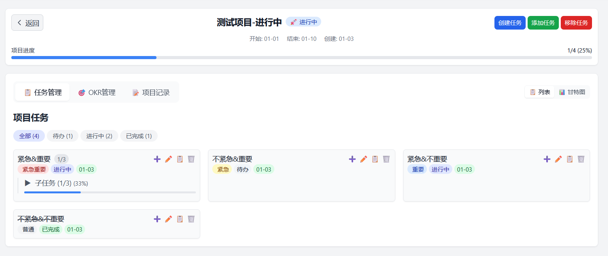
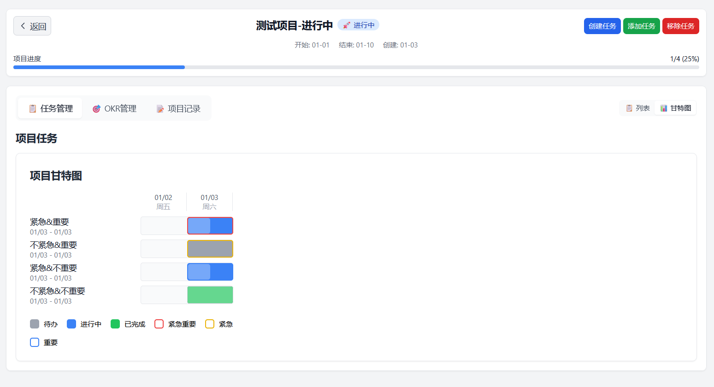

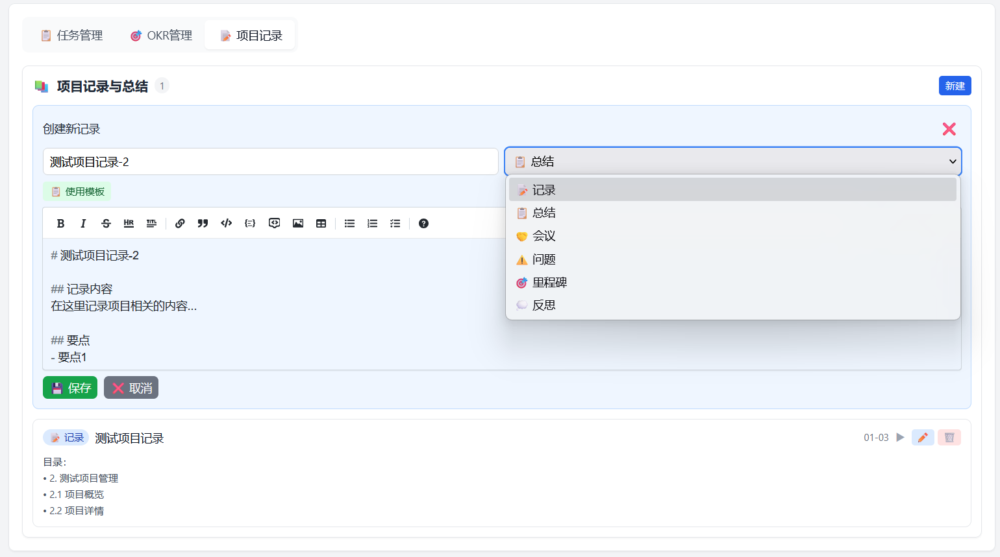


---

#### 2.3 批量删除项目

与任务类似，支持批量删除项目：

1. 点击删除按钮进入选择模式
2. 勾选项目（支持全选）
3. 确认删除

📸 **截图指引**：

---

### 3. 仪表盘

#### 3.1 数据统计

首页仪表盘展示关键数据：

- 任务总数和完成率
- 今日到期任务
- 逾期任务提醒
- 本周任务概览

📸 **截图说明**：

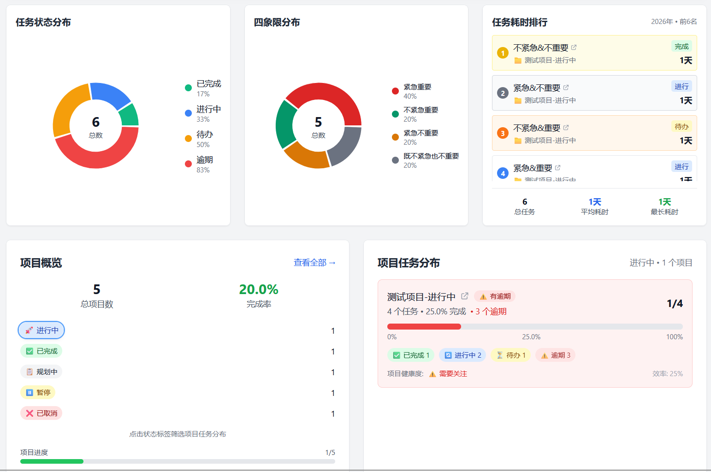
---

### 4. OKR 目标管理

#### 4.1 目标与关键结果

设定目标（Objectives）和关键结果（Key Results）：

- 创建季度/年度目标
- 为每个目标设定可衡量的关键结果
- 跟踪目标完成进度

📸 **截图说明**：


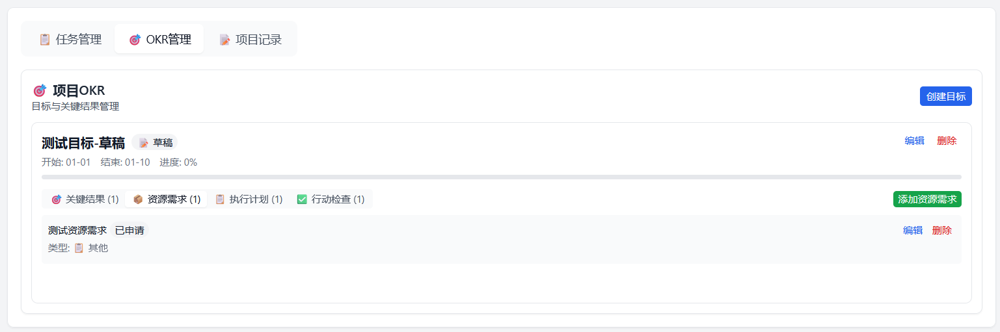


---

### 5. 日程管理

#### 5.1 日程展示

展示阳历、农历和节假日的信息：

- 按月展示当前日期的任务
- 任务可以修改
- 根据紧急&重要程度进行排序

📸 **截图说明**：


---

## ✨ 产品亮点

### 🎨 现代化 UI 设计

- 简洁清爽的界面风格
- 响应式布局，适配不同屏幕
- 流畅的动画过渡效果
- 直观的拖拽交互

---

### ⚡ 高效的操作体验

- **快捷键支持**：Ctrl+F 快速搜索
- **拖拽操作**：拖拽改变任务状态/分类
- **批量操作**：批量删除任务和项目
- **内联编辑**：直接点击编辑，无需打开弹窗

---

### 🏷️ 灵活的标签系统

- 自定义标签颜色
- 标签描述说明
- 多标签分类
- 可视化标签管理


---

### 📊 多视图切换

同一数据，多种展示方式：

| 视图 | 适用场景 |
|------|----------|
| 四象限 | 优先级决策 |
| 看板 | 状态跟踪 |
| 个性化 | 自定义分类 |


---

## 🛠️ 技术栈

### 前端
- React 18 + TypeScript
- Tailwind CSS
- Zustand 状态管理
- Vite 构建工具

### 后端
- Node.js + Express
- Prisma ORM
- SQLite 数据库
- JWT 认证

---

## 🚀 快速开始

### 一键启动

Windows 用户双击 `start.bat` 即可启动项目：

```
前端: http://localhost:5173
后端: http://localhost:5000
```

### 停止服务

运行 `stop.bat` 停止所有服务。

---

*文档版本: 1.0*
*最后更新: 2026年1月*
